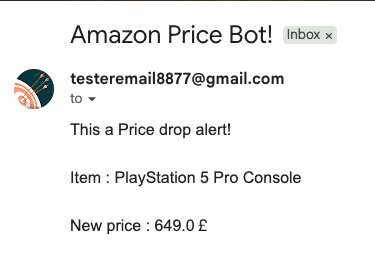

# 🛒 Amazon Price Tracker with Alerting

A Python based price monitoring and alerting system that tracks Amazon product prices in real time, evaluates them against user defined thresholds, and sends automated email notifications when a price drop is detected.

The project demonstrates practical web scraping, conditional alert logic, and error handling using Python, BeautifulSoup, and `requests`.

---

## ⚡ At a Glance

| | |
|---|---|
| 🔧 | Scrapes product title, price, and availability from any Amazon product page |
| 🧠 | Uses custom HTTP headers (`User-Agent`, `Accept-Language`) to avoid detection |
| 🎯 | Compares current price against a target threshold |
| 📧 | Sends an email alert when price ≤ target |
| 🔁 | Can be scheduled to run periodically (e.g., every hour via Cron job locally due IP based geo blocking) |

---

## 📌 Key Features

- 🔍 **Robust scraping** – extracts price using CSS selectors that handle decimal/integer formats and old price (strikethrough) detection
- 🛡️ **Anti‑detection** – mimics a real browser with custom headers; raises an exception if CAPTCHA or login wall is detected
- 🧹 **Clean price extraction** – uses regex to remove currency symbols and commas, converts to float for comparison
- 📨 **Alert logic** – sends email only when current price ≤ target price (avoids spamming)
- ⚠️ **Error resilience** – handles `requests` exceptions, missing elements, and unexpected page structures gracefully
- ⏲️ **CLI / scheduled friendly** – runs from command line; can be integrated with cron locally on Linux, or Task Scheduler on Win.

---

## 📡 Data Pipeline Architecture

```
User sets TARGET_PRICE and PRODUCT_URL in .env
        ↓
Script reads environment variables
        ↓
Requests Amazon product page with custom headers
        ↓
Checks for CAPTCHA / login wall → raise exception if detected
        ↓
Parse HTML with BeautifulSoup:
  - Product title (from #productTitle)
  - Price (from .a-price .a-offscreen)
  - Availability (optional)
        ↓
If price is None → log error, exit
        ↓
Compare current_price <= target_price
        ↓
If true → construct email subject/body, send via SMTP
        ↓
If false → log "Price still above target", exit
```

---

## ⚙️ Tech Stack

| Tool | Purpose |
|---|---|
| Python 3.x | Core scripting language |
| `requests` | Fetch HTML from Amazon |
| `BeautifulSoup` (bs4) | Parse HTML and extract data |
| `smtplib` + Gmail | Send email alerts |
| `re` (regular expressions) | Clean price strings |
| `dotenv` | Environment variable management |

---

## 🧩 Code Structure

The project is split into two modules:

```
product_data.py      → GetProductData class: fetches page, parses title and price
send_email.py        → Reads target price from environment, compares, sends alert
```

**product_data.py** contains:
- `GetProductData.__init__()` – sets up headers, fetches page, raises on CAPTCHA or HTTP error
- `parse_price_data()` – extracts price using `.a-price .a-offscreen` selector
- `parse_item_name()` – extracts product title from `#productTitle`

**send_email.py**:
- Loads environment variables with `dotenv`
- Defines `TARGET_PRICE` (can be moved to `.env` for flexibility)
- Calls `product_data.product.parse_price_data()` and `parse_item_name()`
- Prints product name, current price, target price to console
- Sends email via Gmail SMTP if price ≤ target

---

## 📊 Example Output (Console + Email)

**Console when price is above target:**
```text
Product: PlayStation®5 Pro Console
Current price: £589.99
Target price: £800
Price still above target. No alert sent.
```

**Console when price drops below target:**
```text
Product: PlayStation®5 Pro Console
Current price: £549.99
Target price: £800
Alert sent!
```

**Console when price extraction fails (e.g., page structure changed):**
```text
Price Unavailable, check the product page.
```

**Email received when price drop is detected:**
```text
Subject: Amazon Price Bot!

This a Price drop alert!

Item : PlayStation®5 Pro Console

New price : 549.99￡

Buy now: https://www.amazon.co.uk/PlayStation-PS5-Pro-5-Console/dp/B0FR94FV8J/...
```
> **Note:** The email is plain text and includes the product name, new price, and a direct link to the Amazon product page. The currency symbol appears as `￡` (fullwidth pound) due to the character used in the script.

---

## 📧 Sample Email Alert

Below is a real screenshot of the email received when a monitored product price falls below the target threshold.



---

## 🔁 Automating the Script

The script can be run on a schedule using your local operating system’s scheduler, because **GitHub Actions is not suitable for Amazon scraping**.

**Why GitHub Actions is not used:**  
Amazon actively blocks IP addresses from major cloud providers, including GitHub’s runner containers. Any request from a GitHub Actions workflow will likely be blocked (CAPTCHA or “Request blocked” page), regardless of custom headers.

**Local automation options:**
- **Linux/macOS:** `crontab -e` and add a line like  
  `0 * * * * cd /path/to/project && python send_email.py`
- **Windows:** Use Task Scheduler to run the script hourly.

These options use your home IP address, which has a much lower chance of being blocked by Amazon.

---

## 🚀 Getting Started

```bash
# Clone the repository
git clone https://github.com/your-username/amazon-price-tracker.git
cd amazon-price-tracker

# Install dependencies
pip install requests beautifulsoup4 python-dotenv

# Create a .env file with:
SENDER_EMAIL=your_email@gmail.com
SENDER_EMAIL_PASS=your_app_password
RECEIVER_EMAIL=your_email@gmail.com

# (Optional) Edit TARGET_PRICE inside send_email.py, or move it to .env

# Run the script once
python send_email.py
```

> ⚠️ Amazon may change its HTML structure over time. Update the CSS selectors in `parse_price_data()` if the script stops working. Use a Gmail App Password for `SENDER_EMAIL_PASS`.
